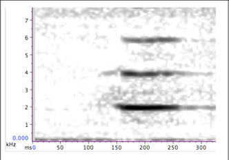

In the following tables you will a description and some illustrations of the ape signals (gestures, body signals, vocalizations, facial expressions) included in the template. These lists are not exhaustive but include all the signals that have been observed and analyzed for the purpose our different studies.

## Ape gestures

Gestures in the following table were illustrated by Sidney Maffini.

(see Byrne et al. 2017 for a comparison of gesture repertoires across ape species)

| Gesture | Modality   A=audible   <nobr>S=silent visible</nobr>   T=tactile| Description | Illustration
|:--------|:-------:|:-------:|:-------:|
|Beckoning arm|S|Stretching arm toward another, followed by a sideways sweeping movement of the arm toward the self and ending with a twirl of the wrist from palm upward to downward, indicates invitation to approach and follow|  |
|Beckoning head|S|Head jerking movement on side indicating a direction to follow|  |
|Beckoning shoulder|S|Exaggerated movement of shoulder and arm when standing up or turning to walk away, indicates direction of travel movement, accompanied by recipient monitoring (look back), invitation to follow| Coming soon|
|Big loud scratch|A|Loud exaggerated scratching movement on own body (supposedly intentional to indicate location of desired grooming)| Coming soon|
|Clap hands|A|Tapping both palms of hands against each other| Coming soon|
|Clap feet|A|Tapping both sole of feet against each other|  |
|Climb-on|S|Sweeping movement of the arm over own opposite shoulder, invitation to climb on back| |
|Directional Hand-on|T|Touching other’s body part (usually back) with palm of hand and maintaining touch for more than 2 s to orient other in a  desired direction| |
|Directional push|T|Gentle push on another’s body part with hand(s), arm(s), feet or head, to orient partner’s body in desired direction| |
|Drum_other |A/T|Drumming other’s body part with fists or palms| |
|Drum object|A|Drumming an object with fists| Coming soon|
|Embrace|T|Signaller wraps arm(s) around recipient and maintains physical contact|  |
|Fingers flex|S|Stretching hand out toward another with rapid alternation of stretching and bending movements of fingers|  |
|Flap|S|Raising one arm and hand and making a downward slapping movement of the arm in front of another, in the air| TO ADD|
|Flap leg|S|Sitting with knees bent, one or both legs opened and closed to the side (single or repeated)| |
|Flap with object|S|Raising one arm and hand and making a downward slapping movement of the arm in front of another with object held in hand, in the air| Coming soon|
|Grab|T|Grabbing gently another’’s body part with closed hand(s)|  |
|Grab-pull|T|Grabbing gently another ‘s body part with closed hand(s) and pulling towards self| |
|Hand on|T|Touching head (or other body part) of another with palm(s) of hand(s) and maintaining touch for more than 2 s|  |
|Head bob|S|Bobbing head up and down| |
|Head jerk|S|Throwing chin upwards abruptly| |
|Head nod|S|Nodding head up and down in the body x axis| |
|Head butt|T|Touching head (or other body part) of another with head and maintaining touch for more than 2 s| Coming soon|
|Hide|S|Hidding own body part, (e.g. face, genitals,…) with hand(s) or arm(s)| Coming soon|
|Hit with object|T|Hitting another with object held in hand| Coming soon|
|Hit object|A|Hitting object with closed fist| Coming soon|
|Hit object with object|A|Hitting object with object held in hand| Coming soon|
|Kick|T|Kicking another’s body with foot| Coming soon|
|Knock object|A|Hitting an object forcefully and multiply with fist or wrist| Coming soon|
|Leaf clip|A|Strips are torn from a leaf/leaves using hand or mouth, making a conspicuous rhythmic sound| Coming soon|
|Move object|S|Grabbing an object with hand (s) and moving it away or pulling it| Coming soon|
|Out arm|S|Raising one (both) arm(s) laterally on side of body at about shoulder level| |
|Out leg|S|Raising one leg at hip level (like a dog peeing)| |
|Poke|T|Touching firmly and briefly another’s body part with finger, may be repetitive| |
|Punch|T|Hitting another forcefully and singly with fist(s) or wrist(S)| Coming soon|
|Push|T|Pushing away gently another with hand(s) or arm(s)|  |
|Raise arm|S|Raising one (both) arm(s) above head level| |
|Raise leg|S|Raising one leg above hip level| Coming soon|
|Rap object|A|Rapping object on the ground back and forth repetitively| Coming soon|
|Reach hand|S|Holding a hand toward another by extending the arm and hand|  |
|Reach leg|S|Holding a foot toward another by extending the leg and foot| Coming soon|
|Shake arm|S|Shaking loosely one (both) arm(s) from shoulder joint| |
|Shake feet|S|Shaking feet vigorously and loosely from ankle joint| |
|Shake hand|S|Shaking hand vigorously and loosely from wrist joint| |
|Shake head|S|Shaking head from side to side on horizontal axis| Coming doon|
|Shake object|S|Shaking fixed object forcefully with one or both hands| |
|Shake other|T|Shaking other’s body part with one or both hands| Coming soon|
|Shoo (Hand wave off)|S|Raising hand and waving it away from self| .png)|
|Slap|T|Slapping forcefully and singly another with palm of hand| Coming soon|
|Slap object|A|Slapping forcefully and singly object with palm of hand|  |
|Stomp single|A|Stamping ground forcefully with sole of foot| |
|Stomp rhytmic|A|Stamping ground forcefully and alternatively with one foot then the other very rapidly|  |
|Stretch over|S|Stretching and raising arm till about head level with the palm facing downwards, like embracing another’s body without touching, sexual invitation|  |
|Stroke|T|Stroking another individual’s body with gentle back and forth movement of palm of hand or fingers| |
|Swing arm|S|Swinging arm back and forth on side of body, either once or repetitively| |
|Swing leg|S|Swinging leg(s) back and forth on side of body, either once or repetitively| Coming soon|
|Swing under arm|S|Swinging arm back and forth from front of body to between legs| |
|Tap|T|Tapping repetitively another with palm of hand, with firm short contact of the fingers to the other’s body (may include rhythmic repetition or single movement)| |
|Tap object|A|Tapping an object repetitively with palm of hand| |
|Throw object|S|Throwing an object in direction of another |  |
|Throw threat|S|Grabbing an object and performing a forward and forceful movement but the object is not released| |
|Touch|T|Touching gently another individual’s body part with palm of hand, for under 2s| |
|Wave arm|S|Waving arm(s) raised above shoulder level with large back and forth movements| |

## Ape body signals

| Body signal | Modality   A=audible   <nobr>S=silent visible</nobr>   T=tactile| Description | Illustration
|:--------|:-------:|:-------:|:-------:|
|Bite|T|Holding another’s body part between lips or teeth without pressure (mock bite)| Coming soon|
|Bounce|S|Standing on four relaxed limbs and performing rapid up and down movements|Coming soon|
|Bow|S|Bending forward upper body according to the body x axis while standing on two legs|Coming soon|
|Dangle|S|Hangs from arm(s) above another, may shake feet/legs, typically audible with movement in trees| Coming soon|
|Dragging object|A|Dragging object held in hand along side of body (usually branch) while moving forward, charging display| Coming soon|
|Gallop|A|Exaggerated running with forelegs playfully and forcefully stamping the ground (similar to a child imitating a horse galloping| Coming soon|
|Gallop stiff|S|Running with stiff forelegs| Coming soon|
|Jump|S|Both feet leave ground simultaneously with horizontal displacement| Coming soon|
|Look|S|Holding eye-contact with another lasting >2s| Coming soon|
|Open arm|S|Subtle opening of the arm, invitation to body contact|Coming soon|
|Open leg|S|Subtle opening of the leg, invitation to body contact| Coming soon|
|Pirouette|S|Twirling movement of whole body around the body y axis while standing on four legs. Progressive forward movement in space|Coming soon|
|Pounce|T|Displacing through air to land quadrupedally on the body of another| Coming soon|
|Present bipedal|S|Standing bipedally in front of another with arms spread apart, sexual invitation|Coming soon|
|Present concave back|S|Sitting in front of another with arched back to expose genitals with legs spread apart, sexual invitation| Coming soon|
|Present rump|S|Standing quadrupedally in front of another with dorsal side up to expose hindquarters, while looking back at recipient, sexual invitation| Coming soon|
|Present ventral|S|Lying on back in front of another with legs spread apart to expose genitals| Coming soon|
|Present body part|S|Presenting body part by stretching body to deliberately expose an area of own body to another’s attention, usually to be groomed or invitation to climb-on| Coming soon|
|Push object|A|Pushing away forcefully an object with hand usually with body hunched over and accompanying a charging display| Coming soon|
|Rock|S|Rocking movement of whole body while seated | Coming soon|
|Rock bipedal|S|Rocking movement of whole body while standing bipedally| Coming soon|
|Roll over|S|Signaller rolls onto back exposing stomach, can be accompanied by repeated movements of arms and/or legs| Coming soon|
|Side roulade|S|Body is rotated around the head-feet axis while lying on the ground| Coming soon|
|Somersault|S|Twirling forward movement of whole body around the body x axis| Coming soon|
|Stiff stance|S|Standing rigidly with stiff limbs and forelimbs held tight | Coming soon|
|Swagger bipedal|S|Lateral swaying of the upper body| Coming soon|
|Walk stiff|S|Walking with rigid forelegs, with a slow exaggerated movement| Coming soon|
|Walk tandem|T|Placing arm over the body of another and both walk forward while maintaining position| Coming soon|

## Ape vocalisations

| Vocalisation | Description | Context of production | Illustration
|:--------|:-------:|:-------:|:-------:|
|Peeps|High-frequency, closed mouth vocalization. Short in duration and characterised by a simple, flat acoustic form composed of several harmonics that are generally un-modulated|Produced across a large array of contexts, especially common during feeding events and travel|(Clay et al.2015)|
|High hoots|High-pitched long-distance call, like a ‘waah’ |Long distance communication, can be used to communicate between parties and given in response to external disturbance or excitement (e.g.  food arrival) ||
|Contest hoots|Call sequences consisting of an introductory phase (modulated inverted u-shape form), an escalation phase composed of several stereotyped units (unmodulated inverted u-shape), and a let-down phase|Used by males to challenge another individual and display status to others|(Genty et al. 2014)|
|Victim screams|High-pitched, with shrill and rasping sounds given at full vocal strength, large number of harmonics and long in duration, accompanied by teeth-baring (complete lip retraction, exposing both teeth and gums, the mouth may be wide open)|Used by victim after conflict or during tantrums||
|Copulation screams|Single or succession of high-frequency squeaks and screams|Used by females during mating events|(Clay and Zuberbühler, 2011)|
|Pant laughter|Voiceless, jerky breathing which sounds like coarse low-pitched grunting, rather soft, accompanied by play-face|Used during socio-positive interactions, play, chase-play. Mostly given by subordinate to dominant ||
|Laughter|Full laughter, sounds like a ‘ah-ah-ah’|Triggered by physical contact (tickle, bite)||
|Pant grunts (greeting grunts)|A rhythmic series of brief, grunt-like, vocalized air expulsion sounding like a ‘eh-eh-eh’|Close-range vocalisation, uttered during approaches from subordinates to dominants in agonistic situations||
|Alarm peep|Same as Peeps|Given in response to the discovery of a minor threat, or response to surprise||
|Pout moan (or Whimpers)|Low-pitched, melodious call sounding like a whining “hoo-hoo”27, accompanied by pout face (lips are pursed forward and curled outward in front resulting in circular opening).|Used by infants for requests, used by adults during sexual initiations, food begging, or as a appeasement signal in agonistic interactions. Also used as a request  to stop current activity|(Genty, 2019)|
|Threat Barks|Same as barks|Used during aggressive attacks, or if bothered by another individual approach or behaviour||
|Wieew bark|A single, very loud bark, accompanied by facial expression of wide open mouth. Difficult to distinguish from high hoots|Given in response to alarm or hostility rather than excitement.||
|Raspberry|Voiceless sounds, air is pressed through the lips, like a ‘prrrrr’|Used during grooming, or food begging||

## Ape facial expressions

| <nobr> Facial expression</nobr>  | Description | Context of production | Illustration
|:--------|:-------:|:-------:|:-------:|
|Silent bare-teeth|Retraction of the lips resulting in partial or complete exposure of the teeth and gums, with mouth practically closed and without vocalization|Displayed in agonistic and approach-retreat interactions, during sexual interactions. Performed by both subordinate and dominant individuals, expression of fear, nervousness, or hesitation. Demonstrates non-hostile intentions, function as appeasement and reassurance signal.| ©Emilie Genty|
|Tense mouth|Lips show strong horizontal tension. They are either drawn inward or slightly bar- ing the teeth. The mouth may be opened but never widely. No vocaliza- tions accompany the display|Aggressive expression, before or during display behaviours. Displayed also in food competition situations ||
|Pout face|Lips are pursed forward and curled outward in front resulting in a circular opening. The lips are pressed together at the mouthcorners|Displayed to request for food or request physical contact. Sometimes displayed during grooming. Can express disappointment|©Emilie Genty|
|Play-face|Mouth is opened with the lips either a) in a relaxed position covering the upper teeth completely and the lower teeth partially, or b) retracted, without however pulling back the mouth resulting in baring of both the upper and lower and frontal teeth|Displayed during play invitation or play bouts|©Emilie Genty |