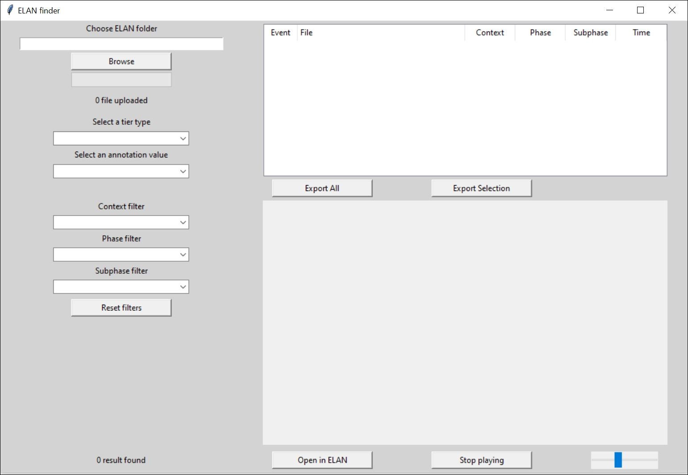

*&copy;Emilie Genty*

## What is it?

**elan_finder** is a free open source software provided under the MIT license. 

Its simple graphical user interface (GUI) provides you with a rapid way to 

  * filter
  * retrieve 
  * preview 
  * export 
  
any of your ELAN annotations across your entire database.

## Demo

## Source code

All source code is made publicly available at [https://github.com/MitchFuchs/elan_finder.git](https://github.com/MitchFuchs/elan_finder.git)

## Prerequisites

#### Operating System (OS)
The current software has been tested on 

  * Ubuntu 20.04
  * Windows 10

#### Software
  * install [git](https://git-scm.com/book/en/v2/Getting-Started-Installing-Git)
  * install [conda](https://docs.conda.io/projects/conda/en/latest/user-guide/install/index.html#)

## Installation

#### On Linux and Windows

Open your Terminal and execute the commands listed below.

Clone the github repository and the source code on your local machine 
`git clone https://github.com/MitchFuchs/elan_finder.git`

Enter the newly created repository  
`cd elan_finder`

Create a new conda environment  
`conda create --name elan_finder python=3.8`

Activate the newly created conda environment 
`conda activate elan_finder`

Install all the required packages 
`pip install -r requirements.txt`

Start the GUI 
`python main.py`

## Getting started

Once the GUI has correctly been launched, you are all set! 

  * First click on 'Browse' and select the folder containing your ELAN database
  * Take a sip of coffee - your annotations are being processed, it will take a few seconds. Breathe. 
  * Select a Tier type in the first dropdown list
  * Select an Annotation value in the second dropdown list

The upper right panel displays all annotations in your database that meet your criteria

  * Optionally (if applicable) select a context, phases and/or subphases filter to refine your results in the three dropdown lists below

In the upper right panel

  * Scroll through your annotations, to display them all
  * Double-click any annotation to preview it in the lower right panel. The preview start at the beginning of your annotation but does not stop at its end

Other functionalities

  * Click on 'Export All' to export all annotations of your database in a spreadsheet format (.xlsx)
  * Click on 'Export Selection' to export all annotations currently selected in a spreadsheet format (.xlsx)
  * Click on 'Open in ELAN' to open the currently selected annotation in ELAN
  * Click on 'Stop playing' to stop the preview
  * Move the cursor left/right to slow down/speed up the preview speed

 
## Support

For support, issues and/or improvements please get in touch [here](https://github.com/MitchFuchs/elan_finder/issues).

We are happy to help!

