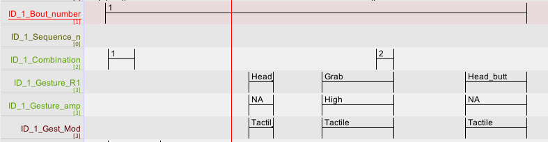
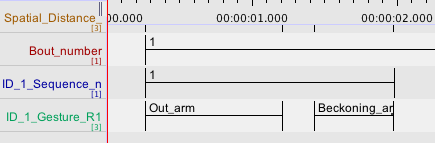

In the following table, we provide a description of all the tiers (variables) contained in the GApS coding template (GApS_coding template.etf) and describe their different attributes.

When you create your own template, you can decide to include all variables in the Elan template or to add some variables related to the dyad and the interacting individuals such as: study species, study site, ID1-ID2 Dyad name, dyad rank difference, Dyad DSI index, signal function (based on ASO), sex (Male, Female), age class (Subadult, Adult,…),… post-hoc directly in the Excel output file. 

<!-- | Tier level | Tier name | Annotation type | Annotation values | Definition of annotations (if applicable) | Segment length | Segment duration | Parent tier | Tier_Type | Controlled_vocabulary | Comments
|:--------|:-------:|:-------:|:-------:|:-------:|:-------:|:-------:|:-------:|:-------:|:-------:|:-------:|
| Interaction   |    |  |    |    |    |     |    |    |    | |
|    | Clip_Name   | Name of media file   | Date-Activity type- ID_1-ID_2-Rater ID; e.g., 16.01.17_ Play_KU_CLB_R1   |    | 3sec   | Fixed 3sec segment (from time 00:00:00)   | None   | None   | None   | In Excel output, the clip name will be only in the first few rows of the column and will have to be copied down across the other rows related to the corresponding interaction. |
| cell4   | cell5   | cell6   |
|-----------------------------|
| cell1   | cell2   | cell3   |
| cell4   | cell5   | cell6   | -->

| Tier level | Tier name | Annotation type | Annotation values | Definition of annotations (if applicable) | Segment length | Segment duration | Parent tier | Tier_Type | Controlled_vocabulary | Comments
|:--------|:-------:|:-------:|:-------:|:-------:|:-------:|:-------:|:-------:|:-------:|:-------:|:-------:|
|Interaction|||||||||||
||Clip_Name|Name of media file|Date-Activity type- ID_1-ID_2-Rater ID; e.g., 16.01.17_ Play_KU_CLB_R1||3sec|Fixed 3sec segment (from time 00:00:00)|None|None|None|In Excel output, the clip name will be only in the first few rows of the column and will have to be copied down across the other rows related to the corresponding interaction. |
||Study_Site|Name of study site|LYB, SD, BSL, SIG, LVS| |3sec|Fixed 3sec segment (from time 00:00:00)|None|Study_site|Study_site|In Excel output, the study site will be only in the first few rows of the column and will have to be copied down across the other rows related to the corresponding interaction.|
||Species|Name of study species |Bonobos, Chimpanzees| |3sec|Fixed 3sec segment (from time 00:00:00)|None|Species|Species|In Excel output, the species name will be only in the first few rows of the column and will have to be copied down across the other rows related to the corresponding interaction.|
||Activity_Type|Type of social activity|e.g., Grooming; Play, Sex; Travel,…| |Activity duration|From onset of first movement typical of activity, to cessation of movements typical of activity|None|Activity_type|Activity_type|In Excel output, type of social activity will be only in the first few rows of the column and will have to be copied down across the other rows related to the corresponding interaction.|
||Dyad_name|Identities of the interacting partners |ID_a@ID_b; e.g., CLB@KU|ID_a is the first name in alphabetic order|3sec|Fixed 3sec segment (from time 00:00:00)|None|Dyad_name|Dyad_name|The dyad name should always be the same throughout the dataset regardless of who is ID_1 in the interaction ( for instance, the dyad  CLB@KU will always be named  CLB@KU regardless of whether CLB is ID_1 or ID_2 in a given interaction), ID_a should be the first in the alphabetic order. In Excel output, the dyad name will be only in the first few rows of the column and will have to be copied down across the other rows related to the corresponding interaction. |
||Dyad_DSI|DSI is an index of dyad bond strength (see Neumann and Kulik, 2014, and Heesen et al. 2021, for description of methods to obtain DSI indices)|| |3sec|Fixed 3sec segment (from time 00:00:00)|None|None|None|In Excel output, the DSI index value will be only in the first few rows of the column and will have to be copied down across the other rows related to the corresponding interaction.|
||ID_1_ID_2_Rank_Diff|Elorating index of rank difference between ID_1 and ID_2 (see Silk et al., 2013 and Heesen et al. 2021, for description of methods to obtain Elorating indices)|| |3sec|Fixed 3sec segment (from time 00:00:00)|None|None|None|In Excel output, the Elorating index value will be only in the first few rows of the column and will have to be copied down across the other rows related to the corresponding interaction. |

| Tier level | Tier name | Annotation type | Annotation values | Definition of annotations (if applicable) | Segment length | Segment duration | Parent tier | Tier_Type | Controlled_vocabulary | Comments
|:--------|:-------:|:-------:|:-------:|:-------:|:-------:|:-------:|:-------:|:-------:|:-------:|:-------:|
|ID_1|||||||||||
||ID_1|Identity of individual who produces the first signal in the interaction |e.g., KZ| |3sec|Fixed 3sec segment (from time 00:00:00)|None|ID|ID|ID_1 corresponds to the identity of the individual who produces the first signal in the interaction. In Excel output, ID_1 name will be only in the first few rows of the column and will have to be copied down across the other rows related to the corresponding interaction. |
||ID_1_Bout _number|Bout number in interaction||A bout is a string of gesture and/or gesture sequences|Length of bout|From beginning of segment of ID_1 first produced gesture, to end of segment of ID_1 last produced gesture|None|None|None||
||ID_1_Sequence_number|Sequence number in interaction||A sequence is a string of 2 or more gestures produced by one signaller without pause, and that follow each other by less than 1 sec.|Length of sequence|From beginning of segment of ID_1 first produced gesture in sequence, to end of segment of ID_1 last produced gesture in sequence  |None|None|None||
||ID_1_Combination_number|Signal combination number in interaction||A signal combination is a string of signals from different sensory modalities (e.g., gesture + call; gesture + facial expression,) produced simultaneously and overlap, or that follow each other by less than 1 sec.|Length of overlap between the signals segments|From beginning to end of overlap between segments of ID_1 first and second produced signals in combination |None|None|None||
||ID_1_Goal reached|Yes/No (0/1)|0;1| |3sec|Fixed 3sec segment (from moment goal is reached, e.g., when first movement typical of activity (e.g., sex, play, grooming) starts|None|Presence|Presence|TO ADD|
||ID_1 _Gesture_R1|Gesture Type|See Table 2 for gesture type definitions | |ID_1 gesture segment length|From onset of movement to produce gesture from a neutral position, to onset of retraction from gesture held position to go back to neutral position (or to start a new gesture, or end  of gesture action) |None|Gesture|Gesture|Tier names must contain the indicators R1 for the first rater and R2 for the second rater for calculating interrater agreement with EasyDIAg (see section 6 of GApS manual)|
||ID_1_Gest_Mod|Sensory modality of gesture type|  Silent-visible; Tactile; Audible||ID_1 gesture segment length|ID_1 gesture segment duration|ID_1_gesture|Modality|Modality||
||ID_1_Gesture_amplitude_R1|Amplitude of gesture in space|Low, Medium, High; NA (See list of amplitudes definition for each gesture of repertoire; in preparation for manuscript)| Low= minimum amplitude; medium= intermediate amplitude; High: maximum amplitude|ID_1 gesture segment length|ID_1 gesture segment duration|ID_1_gesture|Amplitude|Amplitude|Tier names must contain the indicators R1 for the first rater and R2 for the second rater for calculating interrater agreement with EasyDIAg (see section 6 of GApS manual)|
||ID_1_Persistence|Yes/No (0/1)|0;1|If ID_1 gesture is repetition of first ID_1_gesture produced in sequence= 1; if  ID_1 gesture is different from first ID_1_gesture produced in sequence= 0; if ID_1 gesture is repetition of another gesture than first gesture produced in sequence= no annotation|ID_1 gesture segment length|ID_1 gesture segment duration|ID_1_gesture|Presence|Presence||
||ID_1_Elaboration|Yes/No (0/1)|0;1|If ID_1 gesture is repetition of first ID_1_gesture produced in sequence= 0 if  ID_1 gesture is different from first ID_1_gesture produced in sequence= 1|ID_1 gesture segment length|ID_1 gesture segment duration|ID_1_gesture|Presence|Presence||
||ID 1 _overlapping Gesture 1 R1|Gesture Type|See Table 2 for gesture types definitions| |Gesture segment length|From onset of movement to produce gesture from a neutral position, to onset of retraction from gesture held position to go back to neutral position (or to start a new gesture, or end of gesture action)|None|Gesture|Gesture|Tier names must contain the indicators R1 for the first rater and R2 for the second rater for calculating interrater agreement with EasyDIAg (see section 6 of GApS manual)|
||ID_1 _overlapping_Gesture_2_R1|Gesture Type|See Table 2 for gesture types definitions | |Gesture segment length|From onset of movement to produce gesture from a neutral position, to onset of retraction from gesture held position to go back to neutral position (or to start a new gesture, or end of gesture action)|None|Gesture|Gesture|Tier names must contain the indicators R1 for the first rater and R2 for the second rater for calculating interrater agreement with EasyDIAg (see section 6 of GApS manual)|
||ID_1 _Body signal _R1|Body signal type|See Table 3 for Body signal types definitions| |Body signal segment length|From onset of movement to produce body signal to onset of movement to end body signal|None|Body_signal|Body_Signal|Tier names must contain the indicators R1 for the first rater and R2 for the second rater for calculating interrater agreement with EasyDIAg (see section 6 of GApS manual)|
||ID_1 _Vocalisation_R1|Vocalisation Type|See Table 4 for vocalisation types definitions| |Vocalisation segment length|From onset of vocalisation production to end of vocalisation production|None|Vocalisation|Vocalisation|Tier names must contain the indicators R1 for the first rater and R2 for the second rater for calculating interrater agreement with EasyDIAg (see section 6 of GApS manual)|
||ID_1 _Facial expression_R1|Facial expression|See Table 5 for Facial expression types definitions| |Facial expression segment length|From onset of facial movements to produce facial expression, to end od facial expression|None|Facial_expression|Facial_expression|Tier names must contain the indicators R1 for the first rater and R2 for the second rater for calculating interrater agreement with EasyDIAg (see section 6 of GApS manual)|
||ID_1_Gaze orientation_R1|Gaze directed at partner, when facing or looking back at partner|Partner, Gaze_back, | Partner = Signaller is gazing directly at recipient’s face, Gaze back= Signaller is gazing back at partner’s face over his shoulder while walking away|Gaze segment length|From moment gaze is locked on partner to moment gaze is detached from partner|None|Gaze|Gaze|Tier names must contain the indicators R1 for the first rater and R2 for the second rater for calculating interrater agreement with EasyDIAg (see section 6 of GApS manual)|
||ID_1_ Body_part_R1|Recipient's body part touched by ID_2 tactile gesture|Arm; Back; Breast; Face: Fit; Genitals; Hand; Head; Hind; Hip; Leg; Shoulder; Stomach; Wrist; Out_of_Sight| |ID_1 gesture segment length|ID_1 gesture segment duration|None|Recipient_body_parts|Recipient_body_parts|Tier names must contain the indicators R1 for the first rater and R2 for the second rater for calculating interrater agreement with EasyDIAg (see section 6 of GApS manual)|
||ID_1_ Behavioral_response_R1|Behaviour type performed in response to signal produced by ID_2| ||Behaviour segment length|From onset of movement typical of the behaviour to moment behaviour is achieved|None|None|None|Tier names must contain the indicators R1 for the first rater and R2 for the second rater for calculating interrater agreement with EasyDIAg (see section 6 of GApS manual)|
||ID-1 _Signal_function|Function of signal based on ASO (see Hobaiter and Byrne, 2014 for description of ASO)|Attention getter; Leave_taking; Follow_invitation, Contact_invitation; Chase_invitation; Play_contact_invitation; Sex_invitation; Grooming_invitation; Stop:request; Move_away_request| |Corresponding signal segment length|Corresponding signal segment duration|None|Function|Function|Based on ASO (Apparently Stisfactory Outcome, see Hobaiter eand Byrne, 2014), if behavioural outcome appears satisfactory, the signaller should stop signaling. The function of signals can be inferred at the end of the bout. |
||ID_1_Activity_Role|Role of ID_1 in interaction|Groomer; groomee; chaser; chasee; leader; follower| |3sec|3sec|None|Role|Role||

| Tier level | Tier name | Annotation type | Annotation values | Definition of annotations (if applicable) | Segment length | Segment duration | Parent tier | Tier_Type | Controlled_vocabulary | Comments
|:--------|:-------:|:-------:|:-------:|:-------:|:-------:|:-------:|:-------:|:-------:|:-------:|:-------:|
|ID_2|||||||||||
||ID-2|Identity of the individual that is the receiver of the first signal produced in the interaction |e.g., KL| |3sec|Fixed 3sec segment (from time 00:00:00)|None|ID|ID|ID2 corresponds to the ID of individual who was the recipient of the first signal produced in the interaction. In Excel output, ID_2 will be only in the first few rows of the column and will have to be copied down across the other rows related to the corresponding interaction. |
||ID_2_Bout number|Bout number in interaction||A bout is a string of gesture and/or gesture sequences|Length of bout|From beginning of segment of ID_2 first produced gesture, to end of segment of ID_2 last produced gesture|None|None|None||
||ID_2_Sequence_number|Sequence number in bout||A sequence is a string of 2 or more gestures produced by one signaller without pause and that follow each other by less than 1 sec.|length of sequence|From beginning of segment of ID_2 first produced gesture, to end of segment of ID_2 last produced gesture in sequence  |None|None|None||
||ID_2_Combination_number|Signal combination number in interaction||A signal combination is a string of signals from different sensory modes (e.g., gesture + call; gesture + facial expression,) produced simultaneously and overlap, or that follow each other by less than 1 sec.|Length of overlap between the signals segments|From beginning to end of overlap between segments of ID_2 first and second produced signals in combination |None|None|None||
||ID_2_Goal reached|Yes/No (0/1)|0;1| |3sec|Fixed 3sec segment (from moment goal is reached, e.g., when first movement typical of activity (e.g., sex, play, grooming) starts|None|Presence|Presence||
||ID-2_Gaze orientation_ R1|Gaze directed at partner, when facing or looking back at partner|Partner, Gaze_back|Partner = Signaller is gazing directly at recipient’s face, Gaze back= Signaller is gazing back at partner’s face over his shoulder while walking away|Gaze segment length|From moment gaze is locked on partner to moment gaze is detached from partner|None|Gaze|Gaze|Tier names must contain the indicators R1 for the first rater and R2 for the second rater for calculating interrater agreement with EasyDIAg (see section 6 of GApS manual)|
||ID-2_Gesture_R1|Gesture Type|See Table 2 for gesture types definitions||ID_2 gesture segment length |From onset of movement to produce gesture from a neutral position, to onset of retraction from gesture held position to go back to neutral position (or to start a new gesture, or end of gesture action)|None|Gesture|Gesture|Tier names must contain the indicators R1 for the first rater and R2 for the second rater for calculating interrater agreement with EasyDIAg (see section 6 of GApS manual)|
||ID_2_Gest_Mod|Sensory modality of gesture type|Silent-visible, Tactile or Audible||ID_2 gesture segment length|ID_2 gesture segment duration|ID_2_gesture|Modality|Modality||
||ID-2 _Gesture_amplitude_R1|Amplitude of gesture in space|Low, Medium, High; NA. See list of amplitudes definition for each gesture of repertoire (in preparation for manuscript)|Low= minimum amplitude; medium= intermediate amplitude; High: maximum amplitude|ID_2 gesture segment length|ID_2 gesture segment duration|ID_2_gesture|Amplitude|Amplitude|Tier names must contain the indicators R1 for the first rater and R2 for the second rater for calculating interrater agreement with EasyDIAg (see section 6 of GApS manual)|
||ID_2_Persistence |Yes/No (0/1)|0;1|If ID_2 gesture is repetition of first ID_2_gesture produced in sequence= 1; if ID_2 gesture is different from first ID_2_gesture produced in sequence= 0; if ID_2 gesture is repetition of another gesture than first gesture produced in sequence= no annotation|ID_2  gesture segment length|ID_2 gesture segment duration|ID_2_gesture|Presence|Presence||
||ID_2_Elaboration|Yes/No (0/1)|0;1|If ID_2 gesture is repetition of first ID_2_gesture produced in sequence= 0 if ID_2 gesture is different from first ID_2_gesture produced in sequence= 1|ID_2 gesture segment length|ID_2 gesture segment duration|ID_2_gesture|Presence|Presence||
||ID_2_overlapping_Gesture_1_R1|Gesture Type|See Table 2 for gesture types definitions| |Gesture segment length|From onset of movement to produce gesture from a neutral position, to onset of retraction from gesture held position to go back to neutral position (or to start a new gesture, or end of gesture action)|None|Gesture|Gesture|Tier names must contain the indicators R1 for the first rater and R2 for the second rater for calculating interrater agreement with EasyDIAg (see section 6 of GApS manual)|
||ID_2 overlapping_Gesture_2_R1|Gesture Type|See Table 2 for gesture types definitions| |Gesture segment length|From onset of movement to produce gesture from a neutral position, to onset of retraction from gesture held position to go back to neutral position (or to start a new gesture, or end of gesture action)|None|Gesture|Gesture|Tier names must contain the indicators R1 for the first rater and R2 for the second rater for calculating interrater agreement with EasyDIAg (see section 6 of GApS manual)|
||ID-2 _Body_signal_R1|Body signal type|See Table 3 for Body signal types definitions| |Body signal segment length|From onset of movement to produce body signal to onset of movement to end body signal|None|Body_signal|Body_Signal|Tier names must contain the indicators R1 for the first rater and R2 for the second rater for calculating interrater agreement with EasyDIAg (see section 6 of GApS manual)|
||ID_2 Vocalisation_R1|Vocalization Type|See Table 4 for vocalisation types definitions| |Vocalisation segment length|From onset of vocalisation production to end of vocalisation production|None|Vocalisation|Vocalisation|Tier names must contain the indicators R1 for the first rater and R2 for the second rater for calculating interrater agreement with EasyDIAg (see section 6 of GApS manual)|
||ID_2 Facial_Expression_R1|Facial expression type|See Table 5 for Facial expression types definitions| |ID_2 Facial expression segment length|From onset of facial movements to produce facial expression, to end od facial expression|None|Facial_expression|Facial_expression|Tier names must contain the indicators R1 for the first rater and R2 for the second rater for calculating interrater agreement with EasyDIAg (see section 6 of GApS manual)|
||ID_2_Body part_R1|Recipient's body touched by ID_1 tactile gesture|Arm; Back; Breast; Face: Fit; Genitals; Hand; Head; Hind; Hip; Leg; Shoulder; Stomach; Wrist; Out_of_Sight| |ID_2 gesture segment length|ID_1 gesture segment duration|None|Recipient_body_parts|Recipient_body_parts|Tier names must contain the indicators R1 for the first rater and R2 for the second rater for calculating interrater agreement with EasyDIAg (see section 6 of GApS manual)|
||ID_2 Behavioral_response_R1|Behaviour type performed in response to signal produced by ID_1| ||Behaviour segment length|From onset of movement typical of the behaviour to moment behaviour is achieved|None|None|None|Tier names must contain the indicators R1 for the first rater and R2 for the second rater for calculating interrater agreement with EasyDIAg (see section 6 of GApS manual)|
||ID-2_Signal_function|Function of signal based on ASO (see Hobaiter and Byrne, 2014 for description of ASO)|Attention getter; Leave_taking; Follow_invitation, Contact_invitation; Chase_invitation; Play_contact_invitation; Sex_invitation; Grooming_invitation; Stop:request; Move_away_request| |Corresponding signal segment length|Corresponding signal segment duration|None|Function|Function|Based on ASO (Apparently Stisfactory Outcome, see Hobaiter eand Byrne, 2014), if behavioural outcome appears satisfactory, the signaller should stop signaling. The function of signals can be inferred at the end of the bout.|
||ID_2 _Activity_Role|Role of ID_2 in interaction|Groomer; groomee; chaser; chasee; leader; follower| |3sec|Fixed 3sec segment (from onset of movement typical of the activity; e.g., when first movement typical of sex, play, or grooming starts )|None|Role|Role||

| Tier level | Tier name | Annotation type | Annotation values | Definition of annotations (if applicable) | Segment length | Segment duration | Parent tier | Tier_Type | Controlled_vocabulary | Comments
|:--------|:-------:|:-------:|:-------:|:-------:|:-------:|:-------:|:-------:|:-------:|:-------:|:-------:|
|Dyad|||||||||||
||Mutual_gaze|ID_1 and ID_2 gaze directly at each other simultaneously|1| |Length of overlap between ID_1 Gaze orientation and ID_2_Gaze orientation segments|From beginning of overlap between segments of ID_1_Gaze_orientation and ID_2_Gaze_orientation, to end of overlap between segments of ID_1_Gaze_orientation and ID_2_Gaze_orientation |None|None|None|See section 2.2.4.4. of GApS manual for automatically creating overlapping segments|
||Spatial Distance_R1|Spatial distance between ID_1 and ID_2 when a gesture is produced |0;1;2 |0=physical contact, 1=at arm length distance; 2= beyond arm-length distance|Corresponding gesture segment length|Corresponding gesture segment duration|None|None|None|Tier names must contain the indicators R1 for the first rater and R2 for the second rater for calculating interrater agreement with EasyDIAg (see section 6 of GApS manual)|
||Role_Reversal|Activity roles reversal |1|From groomer to groomee or vice versa, from chaser to chasee and vice versa, from leader to follower and vice versa.|3ms|Fixed 3sec segment (from onset of movement typical of the activity; e.g., when first movement typical of sex, play, or grooming starts , when role changes|None|None|None||
||Turn_taking|Communicative turn-taking between ID_1 and ID_2|1| |Length of gap between end of ID-1 (or ID_2, depending on whose signal came first) signal and beginning of ID-2 (or ID_1, depending on whose signal came first) signal|From end of segment ID_1_gesture, to start segment ID_2, and vice versa depending on sequential order of gesture|None|Presence|Presence||
