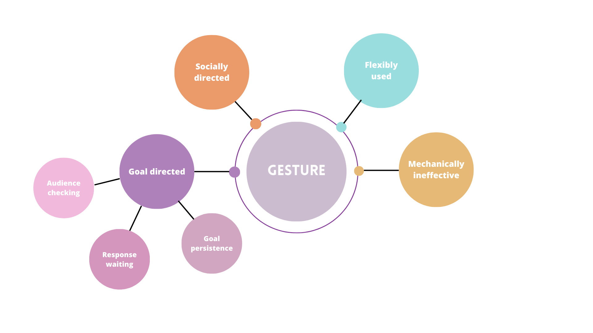

We define a gesture as:
  1. **a mechanically ineffective** physical movement of the limbs or head: the signaler must reach its goal, i.e., modify the recipient’s behavior in a desired way, only by signaling to the recipient and not by forcing the recipient to behave in a certain way (e.g., request the recipient to move away by signaling, instead of pushing the recipient away by using physical force),   
  2. used **flexibly** (i.e., a gesture is not restricted to one context of production and can serve several functions),
  3. **socially directed** at a specific recipient: the signaler orients itself towards and look at a specific recipient
  4. used in a **‘goal-directed’** way to influence the recipient’s behavior in a desired way. To qualify as ‘goal-directed’, a gesture has to be accompanied by:  

      1. **audience checking**: the signaller looks at the recipient before or during gesturing, checks its attentional availability before producing a signal, and adjust the modality of the signal to the attentional state of the recipient (i.e., by using tactile or audible signals instead of silent-visual ones, or by moving around to place itself in the visual field of the recipient, if the recipient is not visually attentive), thus demonstrating sensitivity to the recipient attentional state. 

      2. **response waiting**: the signaller pauses and maintains visual contact with recipient after gesturing, and waits for a response. If the signaler does not respond, then the signaler should show signs of **goal persistence** by:
       
      3. **persisting** (by repeating the same signal) and/or **elaborating** (by using a new signal or combination of signals with the same function). 

Body signals are defined in similar terms for physical movements or postures of the whole body (that can be part of the species typical repertoire such as sexual invitation postures or display behaviours). For each gesture (and body signal), we determined the sensory modality as ‘silent-visible’ (signal is silent and as such only visible if recipient is visually attentive), ‘audible’ (signal is visible and audible, thus can be perceived even if recipient is not visually attentive) or ‘tactile’ (signal is performed while touching the recipient’s body, thus can be perceived even if recipient is not visually attentive). (Genty et al. 2019; Byrne et al., 2017)
